# Text Adventure Game User Flow

```mermaid
flowchart TD
    Start([User Starts Game]) --> NewGame{New or Load?}
    NewGame -->|New Game| CharacterCreation[Character Creation]
    NewGame -->|Load Game| LoadSave[Load Saved Game]
    
    LoadSave --> GameLoop
    CharacterCreation --> GameLoop
    
    subgraph GameLoop [Game Loop]
        direction TB
        State[Game State] --> DisplayState[Display Current State]
        DisplayState --> UserInput[User Input]
        UserInput --> AIProcessing[AI Processing]
        AIProcessing --> WorldUpdate[Update World State]
        WorldUpdate --> State
    end
    
    GameLoop --> SaveGame{Save Game?}
    SaveGame -->|Yes| SaveState[Save Current State]
    SaveGame -->|No| Continue
    
    SaveState --> Continue{Continue Playing?}
    Continue -->|Yes| GameLoop
    Continue -->|No| End([End Game])
    
    subgraph AIProcessing [AI Processing Detail]
        direction TB
        ParseInput[Parse User Input] --> ValidateAction[Validate Action]
        ValidateAction --> GenerateResponse[Generate Response]
        GenerateResponse --> UpdateWorld[Calculate World Changes]
    end
    
    subgraph WorldUpdate [World Update Detail]
        direction TB
        ApplyChanges[Apply State Changes] --> UpdateObjects[Update Objects]
        UpdateObjects --> UpdateNPCs[Update NPCs]
        UpdateNPCs --> UpdateQuests[Update Quests]
    end
    
    subgraph State [Game State Detail]
        direction TB
        PlayerState[Player Status] --> Inventory[Inventory]
        Inventory --> Location[Current Location]
        Location --> QuestStatus[Quest Status]
        QuestStatus --> WorldState[World State]
    end

    classDef default fill:#f9f9f9,stroke:#333,stroke-width:2px;
    classDef process fill:#e1f3d8,stroke:#82c91e,stroke-width:2px;
    classDef decision fill:#fff3bf,stroke:#fab005,stroke-width:2px;
    classDef state fill:#d0ebff,stroke:#339af0,stroke-width:2px;
    classDef endpoint fill:#ffd8d8,stroke:#ff6b6b,stroke-width:2px;
    
    class Start,End endpoint;
    class NewGame,SaveGame,Continue decision;
    class GameLoop,AIProcessing,WorldUpdate process;
    class State,PlayerState,Inventory,Location,QuestStatus,WorldState state;
```

## Flow Description

### Main Flow
1. **Start**: User initiates the game
2. **New/Load Decision**: Choose between starting a new game or loading a saved game
3. **Character Creation**: For new games, create a character
4. **Game Loop**: Main gameplay cycle
5. **Save Game**: Option to save progress
6. **Continue**: Choose to continue playing or end the game

### Game Loop Detail
1. **Game State**: Current state of the game world
   - Player Status
   - Inventory
   - Location
   - Quest Status
   - World State
2. **Display State**: Show relevant information to the user
3. **User Input**: Accept and process user commands
4. **AI Processing**: Process input and generate responses
5. **World Update**: Apply changes to the game world

### AI Processing Detail
1. **Parse Input**: Understand user commands
2. **Validate Action**: Check if action is possible
3. **Generate Response**: Create appropriate response
4. **Calculate Changes**: Determine effects on game world

### World Update Detail
1. **Apply Changes**: Update game state
2. **Update Objects**: Modify object states
3. **Update NPCs**: Process NPC behaviors
4. **Update Quests**: Progress quest states

## Key Features
- Persistent game state
- Dynamic world updates
- AI-driven interactions
- Quest system
- Inventory management
- Save/Load functionality
